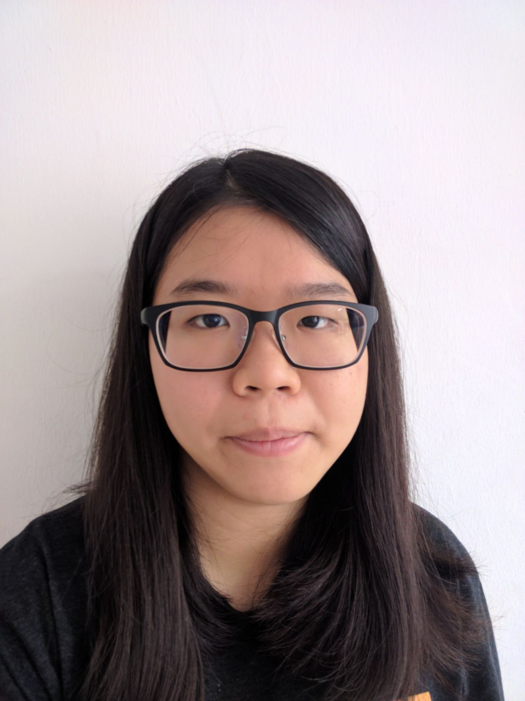

# About Us

We are a team based in the [School of Computing, National University of Singapore](http://www.comp.nus.edu.sg).

## Project Team

#### [Tan Rei Yun](https://github.com/zireiyun)
 
 Role: Developer  
 Responsibilities: GUI, Code Quality

 -----

#### [Wang Ming Rui](https://github.com/mingruimingrui)
 
 Role: Developer  
 Responsibilities: Git manager, input command configuration ,date time parsing/display logic

 -----

#### [Mohamed Irfan](http://github.com/mdirfanpm)
 
 Role: Developer  
 Responsibilities: Logic, Testing

 -----

#### [Hu Zongqi](https://github.com/hzqn1234)
 
 Role: Developer  
 Responsibilities: Model, Deliverables

 -----

# Contributors

We welcome contributions. See [Contact Us](ContactUs.md) page for more info.

* [Akshay Narayan](https://github.com/se-edu/addressbook-level4/pulls?q=is%3Apr+author%3Aokkhoy)
* [Sam Yong](https://github.com/se-edu/addressbook-level4/pulls?q=is%3Apr+author%3Amauris)
