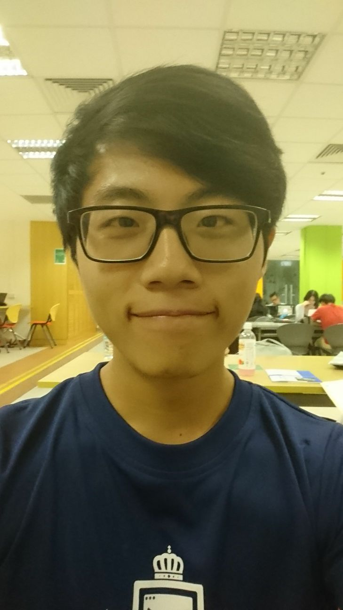

# About Us

We are a team based in the [School of Computing, National University of Singapore](http://www.comp.nus.edu.sg).

## Project Team

#### [Tan Rei Yun](https://github.com/zireiyun)
 
 Role: Developer  
 Responsibilities: GUI, Code Quality, Testing, Feature 'Find', Documentation, Storage

 -----

#### [Wang Ming Rui](https://github.com/mingruimingrui)
 
 Role: Developer  
 Responsibilities: Git manager, Input command configuration, date time parsing/display logic, Part of UI, Model

 -----

#### [Mohamed Irfan](http://github.com/mdirfanpm)
 
 Role: Developer  
 Responsibilities: Logic, Feature 'Undo', Testing

 -----

#### [Hu Zongqi](https://github.com/hzqn1234)
 
 Role: Developer  
 Responsibilities: Feature 'Complete', Feature 'List', Feature 'SetPath', Task Sorting, Part of UI, Testing, Model

 -----

# Contributors

We welcome contributions. See [Contact Us](ContactUs.md) page for more info.

* [Akshay Narayan](https://github.com/se-edu/addressbook-level4/pulls?q=is%3Apr+author%3Aokkhoy)
* [Sam Yong](https://github.com/se-edu/addressbook-level4/pulls?q=is%3Apr+author%3Amauris)
