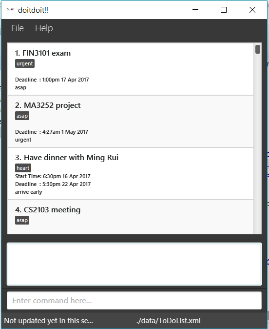

# doitdoit!! - User Guide

By : `Team Just Do It`  &nbsp;&nbsp;&nbsp;&nbsp; Since: `March 2017`  &nbsp;&nbsp;&nbsp;&nbsp;

---

1. [Quick Start](#quick-start)
2. [Features](#features)
3. [FAQ](#faq)
4. [Command Summary](#command-summary)

## 1. Quick Start

0. Ensure you have Java version `1.8.0_60` or later installed in your Computer. 

   > Having any Java 8 version is not enough.  
   > This app will not work with earlier versions of Java 8.

1. Download the latest `todolist.jar` from the [releases](../../../releases) tab.
2. Copy the file to the folder you want to use as the home folder for your To Do List.
3. Double-click the file to start the app. The GUI should appear in a few seconds.
   > 

4. Type the command in the command box and press <kbd>Enter</kbd> to execute it.  
   e.g. typing **`help`** and pressing <kbd>Enter</kbd> will open the help window.
5. Some example commands you can try:
   * **`list`** : lists all tasks
   * **`add`**` study for the finals from: today till: next thursday` :
     adds a new task to study for the finals until next thursday.
   * **`delete`**` 1` : deletes the first task shown in the current list
   * **`exit`** : exits the app
6. Refer to the [Features](#features) section below for details of each command. 

## 2. Features

> **Command Format**
>
> * `PARAMETER NAME` all caps means to enter the parameters this must have a value!
> * `(OPTIONAL PARAMETER)` this bracket means that parameter is optional.
> * `...` which follows parameter mean that the parameter can have multiple inputs.
> * Parameters can be in any order and of any length.

### 2.1. Viewing help : `help`

Format: `help`

> Help is also shown if you enter an incorrect command e.g. `abcd`
> So just type something random to get a quick guide on the commands!

### 2.2. Adding a task: `add`

Adds a Task to the task list 
Format: `add TITLE (from: STARTTIME) (till: DEADLINE) (remarks: REMARKS) (#LABELS...)`
OR: `add TITLE (from: STARTTIME) (due: DEADLINE) (remarks: REMARKS) (#LABELS...)`

> Other than TITLE, all other information is purely optional.
> STARTTIME and DEADLINE inputs are very flexible!
> Try something like `day after like next thursday`, or `4 o'clock`.
> The program however takes in the date and time in American format.
> Meaning that it takes the date in the form month, day, year if the calendar date is given.
> Time is in 24hr format and is defaulted at current time if not specified.

Examples:

* `add Complete Assignment 1 from: now till: friday remarks: 20% of final grade #Assignment` 
* `add Revise tutorial 1 #Assignment` 
* `add Do CS2103 T7 till: thursday 8pm remarks: Remember to make pull request on github #School` 
* `add Buy gift for mom till:7th September #Birthday #Family` 
* `add Finish studing for mid term from: now till: tomorrow #School #Exam` 

### 2.3. Listing tasks : `list`

Shows tasks of specified types in the to do list. 
Format: `list type`

> List tasks of the specified type.
> Three types are available: 'all', 'ongoing', 'completed'.

Examples:

* `list ongoing
  Lists the ongoing tasks.

### 2.4. Editing a task : `edit`

Edits an existing task in the ToDoList. 
Format: `edit INDEX (TITLE) (from: STARTTIME) (till: DEADLINE) (remarks: REMARKS) (#LABELS)`
OR: `edit INDEX (TITLE) (from: STARTTIME) (due: DEADLINE) (remarks: REMARKS) (#LABELS)`

> * Edits the task at the specified `INDEX`.
    The index refers to the index number shown in the last task listing. 
    The index **must be a positive integer** 1, 2, 3, ...
> * At least one of the optional fields must be provided.
> * Existing values will be updated to the input values.
> * Clear all LABELS by entering ` #`, similarly for REMARKS, type `remarks:`

Examples:

* `edit 1 till: next Thursday` 
  Edits the due date of the 1st task to be next Thursday.
* `edit 2 CS2103 homework #` 
  Edits the TITLE of the 2nd task to be `CS2103 homework` and clears all existing LABELS.

### 2.5. Finding all tasks containing any keyword in their task summary: `find`

Finds tasks based on any of the given keywords. 
Format: `find (KEYWORDS...) (#LABEL_KEYWORDS...)`

> * The search is not case sensitive. e.g `hans` will match `Hans`
> * The order of the keywords does not matter. e.g. `Hans Bo` will match `Bo Hans`
> * Tasks matching at least one keyword will be returned (i.e. `OR` search).
    e.g. `Hans` will match `Hans Bo`
> * Only the task title and remarks are searched for keywords (substring match).
> * Only labels are searched for label keywords (full word match).
> * At least one of the optional fields must be present.
> * Only one the search will occur. (keyword search or label search).
> * Task summary search: substrings will be matched e.g. `Hanss` will match keyword `Hans`
> * Label search: full word is matched. e.g. `Hanss` will not match keyword `Hans`

Examples:

* `find homework` 
  Returns `CS2103 homework` and `EE4212 Homework`
* `find homework CS2103 EG2401` 
  Returns Any task having following words containing the substring in task summary `homework`, `CS2103`, or `EG2401`
  * `find #Assignment` 
  Returns `MA1100 #Assignment` and `MA3252 #assignment`

### 2.6. Deleting a task : `delete`

Deletes the specified task from the todolist. Can be undone. 
Format: `delete INDEX`

> Deletes the task at the specified `INDEX`.  
> The index refers to the index number shown in the most recent listing. 
> The index **must be a positive integer** 1, 2, 3, ...

Examples:

* `list` 
  `delete 2` 
  Deletes the 2nd task in the todolist.
* `find homework` 
  `delete 1` 
  Deletes the 1st task in the results of the `find` command.

### 2.7. Completing a task : `edit INDEX c/`

Marks the specified task from the todolist as complete. Can be undone. 
Format: `edit INDEX c/completion_status`

> Marks the task at the specified `INDEX` ad completed or not completed.  
> The index refers to the index number shown in the most recent listing. 
> The index **must be a positive integer** 1, 2, 3, ...

Examples:

* `list` 
  `edit 3 c/yes` 
  Marks the 3rd task in the todolist as complted.
  Hence the task is no longer displayed as by default ongoing tasks are shown after each edit .
* `list completed ` 
  `edit 2 c/no` 
  Marks the 2nd task in the completed task list as incompleted.
  After this, the list of ongoing tasks will be shown.

### 2.8. Clearing all entries : `clear`

Clears all entries from the todolist. Can be undone 
Format: `clear`

### 2.9. Exiting the program : `exit`

Exits the program. 
Format: `exit`

### 2.10. Saving the data

Todolist data are saved in the hard disk automatically after any command that changes the data. 
There is no need to save manually.

### 2.11. Undo last action : `undo`

Undo last action from the todolist. Able to undo up to last 11 actions. 
Format: `undo`

### 2.12. Set storage location : `set_path LOCATION`

Set the storage location as desired. This can be used to store data at a folder linked to the cloud.
Note that after set a new storage location, the application need to restart.
Note that a '.xml' file needs to be specified in the LOCATION paratmeter. 
Format: `set_path LOCATION`

Examples:

* `set_path f:/ToDoList.xml` 
Sets the stroage file to be 'ToDoList.xml' under disk f.

* `set_path default`
Sets the storage file to be default name under default folder.

## 3. FAQ

**Q**: How do I transfer my data to another Computer? 
**A**: Install the app in the other computer and overwrite the empty data file it creates with
       the file that contains the data of your previous To Do List folder.

## 4. Command Summary

Command | User input format
-------- | :--------
**Help** | `help`
**Add** | `add TITLE (from: STARTTIME) (till/due: DEADLINE) (remarks: REMARKS) (#LABELS...)`
**List** | `list`
**Edit** | `edit INDEX (TITLE) (from: STARTTIME) (till/due: DEADLINE) (remarks: REMARKS) (#LABELS)`
**Find** | `find (KEYWORDS) (LABEL_KEYWORDS)`
**Delete** | `delete INDEX`
**Undo** | `undo`
**Clear** | `clear`
**Exit** | `exit`
